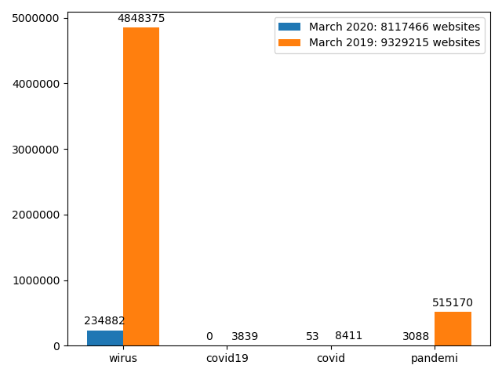
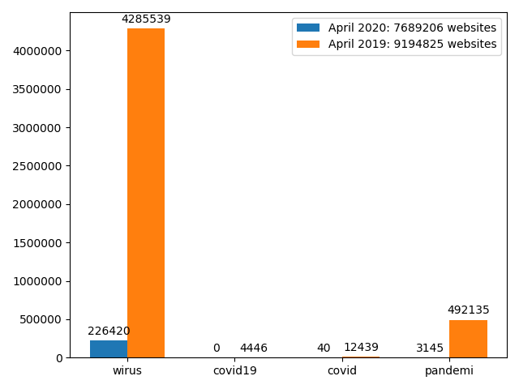

# Project z ASE
## Członki grópy:
* Dmytro Bohynskyi - *171699*  

## Zadanie projektowe:
Wykonaj analizę danych tekstowych pochodzących z różnych stron internetowych. Zebrane dane zgrupowane zostały w foldery odpowiadające dacie zapisu. Zadanie wymaga przeanalizowania danych ze stron stworzynych w jęzku polski w dwóch przedziałach czasowych:
* marzec/kwiecień 2019
* marzec/kwiecień 2020

W rozpatrywanych przedziałach czasowych szukamy wystąpień słów tj. wirus, covid19, covid, pandemia.

Analiza porównawcza powinna pokazywać wzrost użycia wskazanych słów. Wzrost należy pokazać w skali dniowej. Na podstawie meta informacji należy dokonać klasyfikacji tematycznej wykorzystanych do analizy stron

## Python Request async/away
W ramach tego rozwiązania wykorzystywałęm dostępne w internecie API Commoncrawl.
### Rozwiązanie

## Pyspark AWS:EMR
W tym rozwiązaniu wykorzystywałęm mocy obliczniowe AWS:EMR co pozwoliło na szybką obsługę wielkich rozmiarów danych z najleprzą szybkością.

Dla udzyskania danych o parcowanych danych użyłem Common Crawl Index Server z Apache Parquet, który jest obsługiwany przez Spark SQL. 
Gdzie MONTH_INDEX to lista z indeksami misiący na serwerze _crawl_.
Przykład zapytania:
```python
def create_query(index=0):
    # documentation
    month_str = MONTH_INDEX[index]
    fetch_time = ''
    if index == 3:
        fetch_time = "AND fetch_time < '2019-04-01'"
    elif index == 4:
        fetch_time = "AND fetch_time >= '2019-04-01'"
    # Queries for filtering polish webpages from given period of time, which content type is html and returned OK status
    query = f"SELECT collect_list(url) as url, collect_list(fetch_time) as fetch_time, warc_filename, collect_list(" \
            f"warc_record_offset) as warc_record_offset FROM ccindex WHERE crawl = {month_str} " \
            f"AND content_mime_type = 'text/html' AND subset = 'warc' {fetch_time} " \
            f"AND url_host_tld = 'pl' AND fetch_status=200 GROUP BY warc_filename LIMIT 12000 "
```
W ten sposób otrzymaliśmy ramkę z (url) adresami stron i położenia bitów danych 'warc' na serwerze AWS.
Dla pobrania danych wykorzystywałem Python modół ``boto3``.

Ramki 'warc' z stronami HTML są surowę. Dla pobrania tekstu używałem funkcji ``get_text``.
```python
def get_text(html):
    # Detect encoding and extract plain text from page
    encoding = EncodingDetector.find_declared_encoding(html, is_html=True)
    soup = BeautifulSoup(html, "lxml", from_encoding=encoding)
    for script in soup(["script", "style"]):
        script.extract()

    return soup.get_text(" ", strip=True)
```

Dla obliczenia liczby wystąpień słów używałem Pyhton modułu ``re`` w funkcji ``find_covid``:

```python
def find_covid(html):
    """
    This function returns the number of count of words like ['.wirus.', '.covid19.'r'.covid\D', '.pandemi.'] in the site
    :param htmls:
    :return: List with number of count ['.wirus.', '.covid19.'r'.covid\D', '.pandemi.':int]
    """
    covid_words = ('.wirus.', '.covid19.'r'.covid\D', '.pandemi.')
    try:
        # Detect encoding and extract plain text from page
        plain = get_text(html=html)
        container = [len(re.findall(word, plain, flags=re.IGNORECASE)) for word in covid_words]

        return container
    # If cannot parse html content, return none
    except:
        return [ 0, 0, 0, 0]
```


### Rezultaty
* March 2019/March 2020:

* March 2019/March 2020:


Jak widzimy w 2020 znaczny przyrost urzycia słowa ``wirus`` oraz ``pandemia``


## Zbiory danych:
* http://commoncrawl.org/the-data/get-started/ 
* https://registry.opendata.aws/commoncrawl/
 

